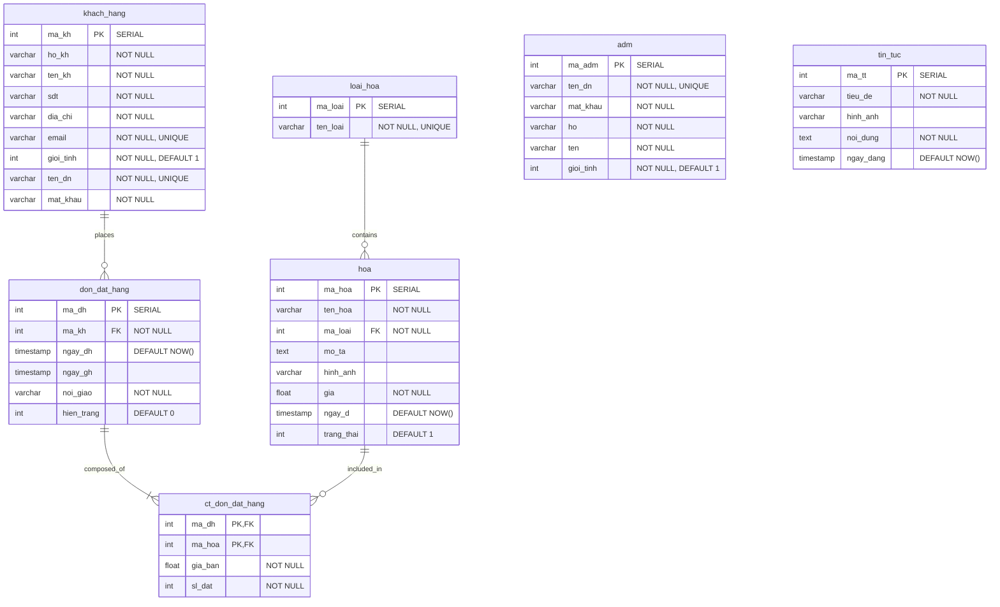

# Floral Charm - Complete REST API Documentation & System Reference

Welcome to the **Floral Charm** API Documentation and System Reference. All application services have been migrated into structured **HTTP REST API Endpoints** for ease of integration, management, and system migration.

---

## 🔐 1. Authentication & Session System

Floral Charm uses **JSON Web Tokens (JWT)** for authentication. User sessions are persisted using HTTP cookies.

### 1.1. Session Cookies
*   `token`: Assigned to customers upon successful login at `/dang-nhap` or registration at `/dang-ky`. (`HttpOnly`, `Path=/`, `Max-Age=3600`)
*   `admin_token`: Assigned to administrators upon login at `/quan-tri/dang-nhap`. (`HttpOnly`, `Path=/`, `Max-Age=3600`)
*   `session_expiry`: Client-readable cookie storing session expiration timestamp in milliseconds. (`Path=/`, `Max-Age=3600`)

### 1.2. JWT Payload Schemas

#### Customer Token Payload (`token`)
```json
{
  "id": 2,
  "ten_dn": "testuser",
  "role": "customer",
  "iat": 1787040000,
  "exp": 1787043600
}
```

#### Admin Token Payload (`admin_token`)
```json
{
  "id": 1,
  "ten_dn": "admin",
  "role": "admin",
  "iat": 1787040000,
  "exp": 1787043600
}
```

### 1.3. Route Protection Middleware (`src/middleware.ts`)
*   **Admin Route Protection** (`/quan-tri/*`): Enforces `admin_token` cookie presence and `role === "admin"`. Redirects unauthenticated users to `/quan-tri/dang-nhap`.
*   **Member Route Protection** (`/thanh-vien/*`, `/thanh-toan/*`): Enforces `token` cookie presence and `role === "customer"`. Redirects unauthenticated users to `/dang-nhap`.

---

## 🌐 2. HTTP REST API Endpoints

All endpoints support JSON (`application/json`) or HTML form data (`application/x-www-form-urlencoded` / `multipart/form-data`) and return structured JSON responses.

---

### 🔑 2.1. Authentication APIs

#### 1. Customer Login
*   **URL:** `/api/auth/login` | **Method:** `POST`
*   **Request Body:** `{ "ten_dn": "testuser", "mat_khau": "password123" }`
*   **Responses:**
    *   `200 OK` (JSON Client): `{ "success": true }` (Set-Cookie: `token`, `session_expiry`)
    *   `303 See Other` (Form Submission): Redirects to `/`
    *   `400 Bad Request`: `{ "error": "Vui lòng nhập đầy đủ thông tin" }`
    *   `401 Unauthorized`: `{ "error": "Tên đăng nhập hoặc mật khẩu không đúng" }`
    *   `500 Internal Server Error`: `{ "error": "Lỗi hệ thống. Vui lòng thử lại." }`

#### 2. Customer Registration
*   **URL:** `/api/auth/register` | **Method:** `POST`
*   **Request Body:**
    ```json
    {
      "ho_kh": "Nguyen Văn",
      "ten_kh": "An",
      "sdt": "0987654321",
      "dia_chi": "456 Đường Nguyễn Trãi, Q5, TP.HCM",
      "email": "vanan@example.com",
      "gioi_tinh": 1,
      "ten_dn": "nguyenvanan1",
      "mat_khau": "SecurePass123",
      "captcha": "KS72W"
    }
    ```
*   **Validation Rules:** `ten_dn` (11-30 chars, unique), `mat_khau` (11-30 chars), `ho_kh`/`ten_kh` (no numbers), `sdt` (starts with 0, 9-12 digits), `email` (valid format, max 50 chars, unique), `dia_chi` (max 200 chars), `captcha` (static match `'KS72W'`).
*   **Responses:**
    *   `201 Created`: `{ "success": true, "user": { "ma_kh": 3, "ten_dn": "nguyenvanan1", ... } }`
    *   `400 Bad Request`: `{ "error": "Tên đăng nhập phải từ 11 đến 30 ký tự" }` (or other validation messages)
    *   `500 Internal Server Error`: `{ "error": "Lỗi hệ thống, vui lòng thử lại sau" }`

#### 3. Logout
*   **URL:** `/api/auth/logout` | **Method:** `GET` or `POST`
*   **Responses:** Clears `token`, `admin_token`, `session_expiry` cookies and redirects to `/` (302 for GET, 303 for POST).

#### 4. Admin Login
*   **URL:** `/api/admin/login` | **Method:** `POST`
*   **Request Body:** `{ "ten_dn": "admin", "mat_khau": "admin123" }`
*   **Special Training Override:** `ten_dn: "admin"` & `mat_khau: "abc@123"` bypasses DB credentials and authenticates Admin payload.
*   **Responses:**
    *   `200 OK` (JSON): `{ "success": true }` (Set-Cookie: `admin_token`, `session_expiry`)
    *   `303 See Other` (Form): Redirects to `/quan-tri/tong-quan`
    *   `401 Unauthorized`: `{ "error": "Tên đăng nhập hoặc mật khẩu không đúng" }`

#### 5. Admin Dashboard Statistics
*   **URL:** `/api/admin/stats` | **Method:** `GET`
*   **Headers:** `Cookie: admin_token=<JWT>`
*   **Responses:**
    *   `200 OK`:
        ```json
        {
          "stats": { "orders": 12, "revenue": 5200000, "products": 50, "customers": 8 },
          "recentOrders": [ { "ma_dh": 15, "ten_kh": "Nguyen Van A", ... } ],
          "newUsers": [ { "ma_kh": 3, "ten_kh": "An", "ten_dn": "nguyenvanan1" } ]
        }
        ```

---

### 🌸 2.2. Products REST API (`/api/products`)

#### 1. List Products
*   **URL:** `/api/products` | **Method:** `GET`
*   **Query Parameters:**
    *   `ma_loai` *(optional)*: Filter by Category ID.
    *   `search` *(optional)*: Filter by flower name substring (case-insensitive `ILIKE`).
*   **Response (`200 OK`):**
    ```json
    {
      "success": true,
      "products": [
        {
          "ma_hoa": 1,
          "ten_hoa": "Bó Hoa Hướng Dương",
          "ma_loai": 2,
          "ten_loai": "Hoa Cúc & Hướng Dương",
          "gia": 350000,
          "trang_thai": 1,
          "mo_ta": "Bó hoa hướng dương rực rỡ",
          "hinh_anh": "/images/sunflower.jpg"
        }
      ]
    }
    ```

#### 2. Create Product
*   **URL:** `/api/products` | **Method:** `POST`
*   **Request Body (JSON / FormData):**
    ```json
    {
      "ten_hoa": "Hoa Hồng Đỏ",
      "ma_loai": 1,
      "gia": 450000,
      "trang_thai": 1,
      "mo_ta": "Bó hoa hồng đỏ kiêu sa",
      "hinh_anh": "/images/red-rose.jpg"
    }
    ```
*   **Validation Rules:** `ten_hoa` (5 to 20 chars), `gia` (5,000 to 7,000,000), `mo_ta` (non-empty, max 250 chars).
*   **Responses:**
    *   `201 Created`: `{ "success": true, "product": { "ma_hoa": 51, ... } }`
    *   `400 Bad Request`: `{ "error": "Tên hoa phải từ 5 đến 20 ký tự" }`

#### 3. Get Single Product
*   **URL:** `/api/products/:id` | **Method:** `GET`
*   **Responses:**
    *   `200 OK`: `{ "success": true, "product": { "ma_hoa": 1, ... } }`
    *   `404 Not Found`: `{ "error": "Không tìm thấy sản phẩm" }`

#### 4. Update Product
*   **URL:** `/api/products/:id` | **Method:** `PUT`
*   **Request Body:** Same schema as Create Product.
*   **Responses:**
    *   `200 OK`: `{ "success": true, "product": { ... } }`
    *   `400 Bad Request`: Validation failure message.
    *   `404 Not Found`: `{ "error": "Không tìm thấy sản phẩm để cập nhật" }`

#### 5. Delete Product
*   **URL:** `/api/products/:id` | **Method:** `DELETE`
*   **Behavior:** Deletes linked line items in `ct_don_dat_hang` before removing record from `hoa`.
*   **Responses:**
    *   `200 OK`: `{ "success": true }`
    *   `404 Not Found`: `{ "error": "Không tìm thấy sản phẩm để xóa" }`

---

### 📁 2.3. Categories REST API (`/api/categories`)

#### 1. List Categories
*   **URL:** `/api/categories` | **Method:** `GET`
*   **Response (`200 OK`):** `{ "success": true, "categories": [ { "ma_loai": 1, "ten_loai": "Hoa Hồng" } ] }`

#### 2. Create Category
*   **URL:** `/api/categories` | **Method:** `POST`
*   **Request Body:** `{ "ten_loai": "Hoa Lan" }`
*   **Responses:**
    *   `201 Created`: `{ "success": true, "category": { "ma_loai": 5, "ten_loai": "Hoa Lan" } }`
    *   `400 Bad Request`: `{ "error": "Tên loại không được để trống" }` or `{ "error": "Loại hoa này đã tồn tại hoặc lỗi hệ thống" }`

#### 3. Get Single Category
*   **URL:** `/api/categories/:id` | **Method:** `GET`
*   **Responses:** `200 OK` with category detail or `404 Not Found`.

#### 4. Update Category
*   **URL:** `/api/categories/:id` | **Method:** `PUT`
*   **Request Body:** `{ "ten_loai": "Hoa Lan Hồ Điệp" }`
*   **Responses:** `200 OK` with updated record or `400 Bad Request` / `404 Not Found`.

#### 5. Delete Category
*   **URL:** `/api/categories/:id` | **Method:** `DELETE`
*   **Validation:** Checks if category contains products (`SELECT count(*) FROM hoa WHERE ma_loai = :id`).
*   **Responses:**
    *   `200 OK`: `{ "success": true }`
    *   `400 Bad Request`: `{ "error": "Không thể xóa loại hoa đang có sản phẩm" }`

---

### 🛒 2.4. Checkout REST API (`/api/checkout`)

#### 1. Process Checkout
*   **URL:** `/api/checkout` | **Method:** `POST`
*   **Request Body:**
    ```json
    {
      "formData": {
        "diaChiGiaoHang": "123 Nguyễn Trãi, Quận 1, TP.HCM",
        "ngayGiaoHang": "2026-08-25"
      },
      "cart": [
        { "ma_hoa": 1, "gia": 350000, "quantity": 2 }
      ]
    }
    ```
*   **Authentication Logic:** Inspects `token` cookie. Defaults to Customer ID `1` if guest checkout.
*   **Database Writes:** Inserts into `don_dat_hang` (`hien_trang = 0`), then inserts cart items into `ct_don_dat_hang`.
*   **Responses:**
    *   `201 Created`: `{ "success": true, "orderId": 18 }`
    *   `400 Bad Request`: `{ "error": "Địa chỉ giao hàng không được để trống" }` or `{ "error": "Giỏ hàng không được để trống" }`
    *   `500 Internal Server Error`: `{ "error": "Lỗi xử lý đơn hàng" }`

---

### 📦 2.5. Orders REST API (`/api/orders`)

#### 1. List Orders
*   **URL:** `/api/orders` | **Method:** `GET`
*   **Query Parameters:** `ma_kh` *(optional)*: Filter by customer ID.
*   **Response (`200 OK`):**
    ```json
    {
      "success": true,
      "orders": [
        {
          "ma_dh": 18,
          "ma_kh": 1,
          "ngay_dh": "2026-08-21T15:00:00.000Z",
          "ngay_gh": "2026-08-25T00:00:00.000Z",
          "noi_giao": "123 Nguyễn Trãi, Quận 1, TP.HCM",
          "hien_trang": 0,
          "ten_kh": "Admin User",
          "tong_tien": 700000
        }
      ]
    }
    ```

#### 2. Get Order Details
*   **URL:** `/api/orders/:id` | **Method:** `GET`
*   **Response (`200 OK`):** Returns order header details and `items` array with product images and names.

#### 3. Update Order Status
*   **URL:** `/api/orders/:id` | **Method:** `PATCH`
*   **Request Body:** `{ "status": 1 }` *(0: Processing, 1: Delivered)*
*   **Responses:** `200 OK` `{ "success": true, "order": { ... } }` or `400 Bad Request` / `404 Not Found`.

#### 4. Delete Order
*   **URL:** `/api/orders/:id` | **Method:** `DELETE`
*   **Behavior:** Deletes order line details in `ct_don_dat_hang` first, then deletes main order record in `don_dat_hang`.
*   **Responses:** `200 OK` `{ "success": true }` or `404 Not Found`.

---

### 👤 2.6. User Profile REST API (`/api/users/profile`)

#### 1. Get Logged-in Profile
*   **URL:** `/api/users/profile` | **Method:** `GET`
*   **Headers:** `Cookie: token=<Customer_JWT>`
*   **Responses:**
    *   `200 OK`: `{ "success": true, "user": { "ma_kh": 2, "ho_kh": "Nguyen", "ten_kh": "An", ... } }`
    *   `401 Unauthorized`: `{ "error": "Phiên đăng nhập hết hạn hoặc chưa đăng nhập" }`

#### 2. Update Profile & Password
*   **URL:** `/api/users/profile` | **Method:** `PUT`
*   **Headers:** `Cookie: token=<Customer_JWT>`
*   **Request Body:**
    ```json
    {
      "ho": "Nguyen",
      "ten": "An",
      "sdt": "0987654321",
      "email": "an.nguyen@example.com",
      "dia_chi": "789 Le Lai, Q1, TP.HCM",
      "gioi_tinh": "Nam",
      "mat_khau": "••••"
    }
    ```
*   **Validation Rules:** `ho`/`ten` (no numbers), `sdt` (starts with 0, 9-12 digits), `email` (valid, max 50), `dia_chi` (max 200), `mat_khau` (if changed from `"••••"`, min 11 chars, hashed via bcrypt). `gioi_tinh` `"Nam"` maps to `1`, else `0`.
*   **Responses:** `200 OK` `{ "success": true, "user": { ... } }` or `400 Bad Request` / `401 Unauthorized`.

---

### 👥 2.7. Members Management REST API (`/api/members`)

#### 1. List Members (Admin)
*   **URL:** `/api/members` | **Method:** `GET`
*   **Response (`200 OK`):** `{ "success": true, "members": [ { "ma_kh": 1, "ho_kh": "Nguyen", "ten_kh": "A", ... } ] }`

#### 2. Get Single Member
*   **URL:** `/api/members/:id` | **Method:** `GET`
*   **Responses:** `200 OK` or `404 Not Found`.

#### 3. Delete Member
*   **URL:** `/api/members/:id` | **Method:** `DELETE`
*   **Validation:** Checks if member has active or past order history in `don_dat_hang`.
*   **Responses:**
    *   `200 OK`: `{ "success": true }`
    *   `400 Bad Request`: `{ "error": "Không thể xóa thành viên đã có lịch sử đặt hàng" }`

---

### 📰 2.8. News REST API (`/api/news`)

#### 1. List News Articles
*   **URL:** `/api/news` | **Method:** `GET`
*   **Response (`200 OK`):** `{ "success": true, "news": [ { "ma_tt": 1, "tieu_de": "Khuyến Mãi 8/3", ... } ] }`

#### 2. Create News Article
*   **URL:** `/api/news` | **Method:** `POST`
*   **Request Body:** `{ "tieu_de": "Tin Tức Mới", "hinh_anh": "/images/news.jpg", "noi_dung": "Nội dung bài viết..." }`
*   **Responses:** `201 Created` `{ "success": true, "news": { ... } }` or `400 Bad Request`.

#### 3. Get Single News Article
*   **URL:** `/api/news/:id` | **Method:** `GET`
*   **Responses:** `200 OK` or `404 Not Found`.

#### 4. Update News Article
*   **URL:** `/api/news/:id` | **Method:** `PUT`
*   **Responses:** `200 OK` with updated news object or `400 Bad Request` / `404 Not Found`.

#### 5. Delete News Article
*   **URL:** `/api/news/:id` | **Method:** `DELETE`
*   **Responses:** `200 OK` or `404 Not Found`.

---

## 🛠️ 3. Next.js Server Actions Wrapper Layer

For backwards compatibility with Next.js form actions, [`src/app/actions`](file:///Users/admin/Documents/training-web-flower-sale/src/app/actions) contains wrapper functions (`addProduct`, `addCategory`, `processCheckout`, `updateOrderStatus`, `updateUser`, `deleteMember`, `addNews`, etc.) that delegate calls directly to the REST API handlers and call `revalidatePath` to refresh cache layers.

---

## 📊 4. Database Entity Reference



---

## 🪱 5. Vulnerability & Flaw Profiles (Training Reference)

> [!WARNING]
> These vulnerabilities are intentionally included for software QA and security testing training.

1. **Missing Server Endpoint Authorization (Broken Access Control)**: REST API endpoints under `/api/products`, `/api/categories`, `/api/news`, `/api/orders`, and `/api/members` accept write operations (`POST`, `PUT`, `DELETE`) without enforcing administrative session tokens.
2. **Weak Authentication (Plain-text Password Fallback)**: `/api/auth/login` and `/api/admin/login` allow direct plain-text string matches against `mat_khau`.
3. **Training Login Bypass**: `/api/admin/login` hardcodes `admin` / `abc@123` override to issue an Admin JWT.
4. **Non-Transactional Checkout**: `/api/checkout` writes to `don_dat_hang` and `ct_don_dat_hang` sequentially without database transaction wrapping.
5. **Static Captcha**: Registration compares `captcha` against static `'KS72W'`.
